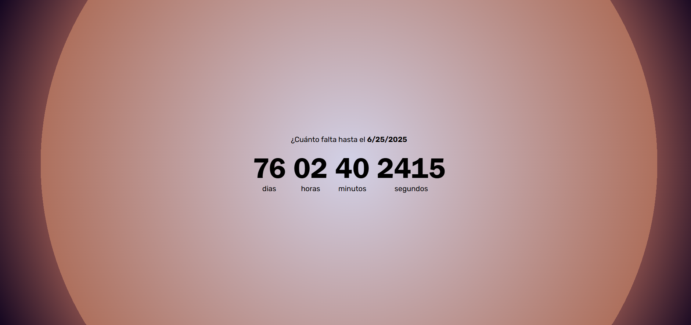

# ⏳ Cuenta Regresiva en JavaScript

Este es un proyecto simple de **cuenta regresiva** hecho con HTML, CSS y JavaScript.  
El usuario puede ingresar una fecha en formato **MM/DD/YYYY**, y el sitio mostrará el tiempo restante hasta esa fecha en **días, horas, minutos y segundos**.  
Cuando el contador llega a cero, se muestra el mensaje **“¡Completado!”**.

🔗 **[Ver el proyecto en línea](https://rodrigopavezreyes.github.io/cuentaRegresivaJs/)**

---

## 🛠 Tecnologías utilizadas

- **HTML** – estructura del sitio
- **CSS** – estilos visuales
- **JavaScript** – lógica del contador y actualización en tiempo real

---

## 🚀 Cómo usarlo

1. Visita el sitio: [https://rodrigopavezreyes.github.io/cuentaRegresivaJs/](https://rodrigopavezreyes.github.io/cuentaRegresivaJs/)
2. Ingresa una fecha futura en el formato **MM/DD/YYYY**.
3. Verás el tiempo restante hasta esa fecha en:
   - Días  
   - Horas  
   - Minutos  
   - Segundos
4. Cuando se alcanza la fecha y hora indicada, el contador mostrará **¡Completado!** 🎉

---

## 📁 Clonar el proyecto

Si querés probarlo localmente:

git clone https://github.com/rodrigopavezreyes/cuentaRegresivaJs.git

---

## 🙌 Agradecimientos

¡Gracias por visitar este proyecto!  
Desarrollado con 💻, 💡 y mucho entusiasmo por **[Rodrigo Pavez Reyes](https://github.com/rodrigopavezreyes)**.
